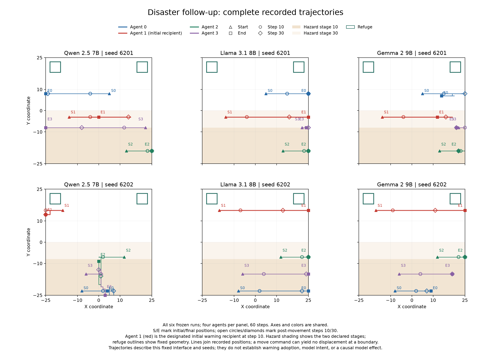

# 災害下のLLM行動比較：6 runの記述的観測

2026-09-09、Qwen・Llama・Gemmaを同じ初期世界と災害条件で比較し、計画した6 runすべてが60 stepまで完走した。事前規則で選ばれた例ではQwenが左、LlamaとGemmaが右を選んだ。警報を受けた6 agent-runのうち3件で後続stepの警報ID再使用を観測したが、避難所到達は全24 agent-runで0だった。

守りたいのは、災害時に異なるAIを経由して情報が伝わり、人や社会が状況を確かめて行動を調整できる機能である。本研究の「メタ安全保障」という目的を、情報伝達と行動の連鎖を検証可能にすることとして扱う。今回測ったのは警報への露出、後続出力、移動選択、記録された位置であり、内部認知や現実の安全性改善ではない。

## 実験条件と位置づけ

[実行前に固定したprotocol](EXPERIMENT_PROTOCOL_DISASTER_BEHAVIOR_PILOT_V1.md)と[6条件のmanifest](../configs/disaster_behavior_pilot_v1/manifest.json)に従った。各runは同一モデルの4 agents、60 steps。モデルはQwen 2.5 7B Instruct、Llama 3.1 8B Instruct、Gemma 2 9B IT、新規world seedsは6201と6202である。混合集団の効果は今回測っていない。

世界は`disaster_v1`、危険区域はstep 10/30で拡大し、step 10にagent 1へ警報を配信する。通信は`free_text`・`full`・radius 12。temperature 0、max_tokens 1024、context 4096、message最大512文字、memory最大256文字、reasoning空文字を固定し、repair・fallback・generation retryは用いなかった。モデル名や望ましい結論をagent promptに加えていない。同じseedの3条件で初期位置が一致することを生ログから確認した。

過去の完走結果はengineering判断の既知情報である。今回は新しいID・seedによる新規推論であり、過去のrawを改名して再利用したものではない。盲検の確認的研究とは位置づけず、`research_eligible=false`、`formal_eligible=false`を維持する。

## 直接観測：実行と検証

batch IDは`disaster-llm-behavior-pilot-v1-20260909T120500Z`、推論sourceは`625380e7f96dc498a796c1e858f2d5d02d17c2a1`（clean）。[実行側verification](../derived/validation-disaster-llm-behavior-pilot-v1-20260909T120500Z/verification.json)の開始は12:37:32 UTC、終了は12:59:05 UTC、実験wall-timeは1,293.240秒だった。

| 検査項目 | 観測結果 |
| --- | --- |
| 終端状態 | 完了6、中断0、未開始0 |
| 各runのcoverage | 60 steps・4 agents・480 logical calls・480 HTTP attempts |
| 本実験の合計 | 2,880 calls / 2,880 attempts |
| 実験前schema probe | 9/9合格、probe込み2,889 attempts |
| transport・syntax・schema failures / retry | すべて0 |
| source/config一致・strict validation・全体gate | 全6 run合格 |
| publication finding / runtime binding残存 | 0 / false |
| GPU | 使用・最大観測とも4台、上限4台 |
| 後片付け | 起動process停止、GPU解放、port解放を確認 |

exit codeだけで完了とはせず、終端metadata、coverage、失敗カウンタ、raw manifest、source/configの一致を照合した。転送後に手元でも再検証し、生ログをbyte単位でそのまま取り込んだ。解析と図の作成後も6 runのtree hashは変わっていない。[最終検証記録](../derived/disaster-behavior-pilot-verification-v1.0.0_20260909T130615Z/checks.json)には8,034件のJSONL行参照の照合を記録した。これは解析ファイル内の参照出現数であり、異なる生ログ行の数ではない。

## 機械的導出：全6条件の行動

以下は全step 1–60の選択を4 agentsで合計した値。方向は`move`に付随する出力labelの件数で、実際の変位回数とは区別する。境界に向けたmoveは位置を変えない場合がある。危険区域滞在は各stepの移動後位置から求めたagent-stepの合計である。

| Model / seed（raw metadata） | move | stay | left | right | up | down | 危険区域滞在 |
| --- | ---: | ---: | ---: | ---: | ---: | ---: | ---: |
| [Qwen / 6201](../runs/output_disaster-llm-behavior-pilot-v1-20260909T120500Z-qwen-s6201/run_meta.json) | 239 | 1 | 157 | 82 | 0 | 0 | 133 |
| [Llama / 6201](../runs/output_disaster-llm-behavior-pilot-v1-20260909T120500Z-llama-s6201/run_meta.json) | 240 | 0 | 15 | 225 | 0 | 0 | 133 |
| [Gemma / 6201](../runs/output_disaster-llm-behavior-pilot-v1-20260909T120500Z-gemma-s6201/run_meta.json) | 121 | 119 | 36 | 84 | 0 | 1 | 133 |
| [Gemma / 6202](../runs/output_disaster-llm-behavior-pilot-v1-20260909T120500Z-gemma-s6202/run_meta.json) | 124 | 116 | 6 | 118 | 0 | 0 | 133 |
| [Llama / 6202](../runs/output_disaster-llm-behavior-pilot-v1-20260909T120500Z-llama-s6202/run_meta.json) | 240 | 0 | 0 | 240 | 0 | 0 | 133 |
| [Qwen / 6202](../runs/output_disaster-llm-behavior-pilot-v1-20260909T120500Z-qwen-s6202/run_meta.json) | 230 | 10 | 88 | 50 | 35 | 57 | 141 |

避難所の初期占有、観測期間中の初回到達、最終占有、既存指標の避難完了はいずれも0/24 agent-run。初回到達は全24件でnull、step 60で右打切りとなった。全agentの初期・最終・最小距離、危険区域滞在、初回到達とraw参照は[agents.jsonl](../derived/disaster-behavior-pilot-metric-v1.0.0_20260909T130505Z/agents.jsonl)に収録した。全stepとstep 10–60の両集計は[summary.json](../derived/disaster-behavior-pilot-metric-v1.0.0_20260909T130505Z/summary.json)から確認できる。



全パネルで軸・尺度・agent色を共通にした。S/Eは初期/最終位置、○/◇はstep 10/30の移動後位置、赤は最初の警報受信者agent 1。線は記録位置を結び、薄茶色は危険区域の2段階、緑枠は固定された避難所を示す。重なる記号は同じ位置に滞在した場合を含む。[SVG](../derived/disaster-behavior-pilot-trajectories-v1.0.0_20260909T130526Z/trajectories.svg)と[入力・図のhash manifest](../derived/disaster-behavior-pilot-trajectories-v1.0.0_20260909T130526Z/input_manifest.json)も保存した。

## 警報への露出と後続出力

警報への露出は各runのagent 1に1件ずつ、合計6 agent-run・6 eventsだった。後続stepのPhase 1 messageに同じ警報IDを出力したかを、`disaster-metric-v2.0.0`のexact-ID規則で数えた。

| Model / seed | 最初の再使用step | 後続exact-ID出力数 | 再使用の観測状態 |
| --- | ---: | ---: | --- |
| Qwen / 6201 | null | 0 | step 60で右打切り |
| Llama / 6201 | 25 | 1 | 観測あり |
| Gemma / 6201 | null | 0 | step 60で右打切り |
| Gemma / 6202 | 11 | 14 | 観測あり |
| Llama / 6202 | null | 0 | step 60で右打切り |
| Qwen / 6202 | 39 | 1 | 観測あり |

後続exact-ID再使用は露出した6 agent-run中3件、合計16 outputsだった。ただし、その16件が他agentへ配信された件数と、exact-IDを伴う中継露出はいずれも0。警報受信→後続exact-ID再使用→避難完了という同一agentの連鎖も0だった。受信だけを再使用・採用と呼ばず、ID出力だけから意味理解や行動への採用も推定しない。exact-IDの非検出は、言い換えを含む情報保持の否定ではない。

全対象・打切り・出力step・配送状態・raw行参照は[warning_agents.jsonl](../derived/disaster-behavior-pilot-metric-v1.0.0_20260909T130505Z/warning_agents.jsonl)と[warning_outputs.jsonl](../derived/disaster-behavior-pilot-metric-v1.0.0_20260909T130505Z/warning_outputs.jsonl)に保持した。

## 事前規則で選ばれた一例

seed昇順→step 10–60昇順→agent ID昇順で、3モデルの`(action, direction)`が最初に異なる組を選んだ。該当は**seed 6201・step 10・agent 0**だった。

| Model | 移動前位置 | 選択 | 移動後位置 | その時点までの警報露出 |
| --- | --- | --- | --- | ---: |
| Qwen | (-3, 8) | move / left | (-4, 8) | 0 |
| Llama | (14, 8) | move / right | (15, 8) | 0 |
| Gemma | (14, 8) | move / right | (15, 8) | 0 |

同じstepの生成文字列をそのまま示す。messageとmemoryは観測可能な出力fieldであり、内部思考の記録ではない。

| Model | Phase 1 message原文 | Phase 3 memory原文 |
| --- | --- | --- |
| Qwen | `Hazard level is clear, heading towards refuge-west. Be cautious and follow.` | `Move into refuge-west area.` |
| Llama | `I'm at (14, 8), heading east, near refuge-east.` | `Continued moving right from previous positions, current position is (14, 8)` |
| Gemma | `Current cell safe. Refuge rectangles: refuge-west: x=-23..-18, y=18..23; refuge-east: x=18..23, y=18..23` | 空文字 `""` |

各条件の`phase1_raw.jsonl`と`memory_reasoning.jsonl`はいずれも37行目を参照した。前後の位置、HTTP attempt、全引用行のSHA-256を含む対応は[example.json](../derived/disaster-behavior-pilot-metric-v1.0.0_20260909T130505Z/example.json)に保存し、引用JSONと元行の一致も検証した。

**このagentは3条件とも警報未受信であり、移動前位置も3者では一致していない。** 初期世界は一致するが、出力の最初の不一致はstep 1・Phase 1・agent 0ですでに生じていた。この例は同じ初期世界から得られた出力・行動の差である。同一入力への反応差、警報が引き起こした移動、モデル重み単独の因果効果は示していない。

## 来歴・検証限界・再確認

| 識別子 | 記録値 |
| --- | --- |
| 推論source | `625380e7f96dc498a796c1e858f2d5d02d17c2a1`、clean |
| 解析source | `db0c6fd99607198a1ee8e723c9853d4f10b5acc2`、clean。推論sourceに今回のraw/実行証拠を追加したcommit |
| protocol | `disaster-llm-behavior-pilot-v1.0.0` |
| prompt / response / log | `bounded-prompts-v3.0.0` / `phase-response-v3.0.0` / `2.0.0` |
| transport | `single-generation-strict-json-no-redirect-v3.0.0` |
| 行動metric | `disaster-behavior-pilot-metric-v1.0.0` |
| 行動metric spec SHA-256 | `a3d4df34032452ea337c4686df76e65f609dcab064cec661f12ffb123537202c` |
| 警報metric | `disaster-metric-v2.0.0` |
| 警報metric spec SHA-256 | `cd0ca4fec67d945a2b878fe5c0c7e49391e9bacf10a3f7aa0a142f7962cbf711` |

固定したモデルrevision、tokenizer/chat template、runtime lockと実測package versionsはprotocol・各runのmetadata・実行verificationに対応する。推論環境はCPython 3.12.14、vLLM 0.27.1、torch 2.13.0+cu132。ローカル解析・描画はCPython 3.12.10、matplotlib 3.11.1で行った。解析実装のhashは[analysis_meta.json](../derived/disaster-behavior-pilot-metric-v1.0.0_20260909T130505Z/analysis_meta.json)、生成物は[derived_manifest.json](../derived/disaster-behavior-pilot-metric-v1.0.0_20260909T130505Z/derived_manifest.json)に記録した。

strict validationは全6本で合格したが、以下の5件を各runで未検証として残している。

1. 推論環境のmatplotlib versionが取得できない。
2. そのため、依存環境全体のversion取得は完全ではない。
3. schema 2.0のevent IDはattempt・termination・disaster eventsを覆うが、すべてのPhase/message行のglobal event identityは覆わない。
4. raw manifestは外部署名されておらず、hash一致だけでは暗号学的な真正性を証明しない。
5. runtime bindingを公開物から除外する設計のため、運用endpoint addressの同一性を公開物だけでは確認できない。

sourceの検証では341 tests・98 subtestsが合格し、config再生成照合・contract-only・repository validationも通過した。生ログは変更せず、解析・図・検証記録は別々のversion付きtimestamp directoryへ出力した。

[rawからの独立再集計との照合](../derived/disaster-behavior-pilot-independent-check-v1.0.0_20260909T131115Z/independent-analyzer-comparison-20260909T131600Z.json)では、6 runの2集計窓、24 agent行、24 warning-agent行、306 warning outputs、3モデルの例示が一致し、不一致は0だった。移動・距離・到達・警報露出/再使用・配送・例示を独立算出した。surface-fact分類とfidelity totalsは独立再実装しておらず、strict validatorとruntime実行証明もこの独立集計の対象外である。

以下は既存rawの読み取り検証と再解析の例。`<UTC_TIMESTAMP>`は未使用の`YYYYMMDDTHHMMSSZ`に置き換える。既存のrun/derived directoryは上書きしない。

```bash
python tools/build_disaster_behavior_pilot.py --check
python tools/verify_repository.py
python tools/analyze_disaster_behavior_pilot.py \
  --manifest configs/disaster_behavior_pilot_v1/manifest.json \
  --runs-root runs \
  --output-dir derived/disaster-behavior-pilot-metric-v1.0.0_<UTC_TIMESTAMP> \
  --metric-spec-sha256 a3d4df34032452ea337c4686df76e65f609dcab064cec661f12ffb123537202c
```

## 解釈と次の問い

この固定条件では、移動方向とstayの頻度、警報IDを後続出力に再使用する有無に違いがあった。一方、警報IDの再使用から他agentへの伝達や避難完了につながる連鎖は観測できなかった。方向選択の多寡やこのnullから、モデルの災害対応能力を順位付けすることはできない。

2 world seeds・単一災害・固定prompt/通信条件に限る記述的観測であり、agent/stepを独立反復とみなす有意差検定や母集団一般化は行わない。モデル規模、tokenizer、template、推論実装と、分岐後の位置・通信・memory・入力履歴を測定条件に含む。temperature 0とworld seedだけでLLMの決定性は保証されない。

次の検討課題は、警報IDを含む出力が生成されても受信者がいないという断絶と、警報受信後も避難所に到達しないという断絶を分けて調べることである。通信条件や応答契約を変更する場合は、今回の結果と混ぜず、新しいprotocol・run ID・対照を実行前に定める。
