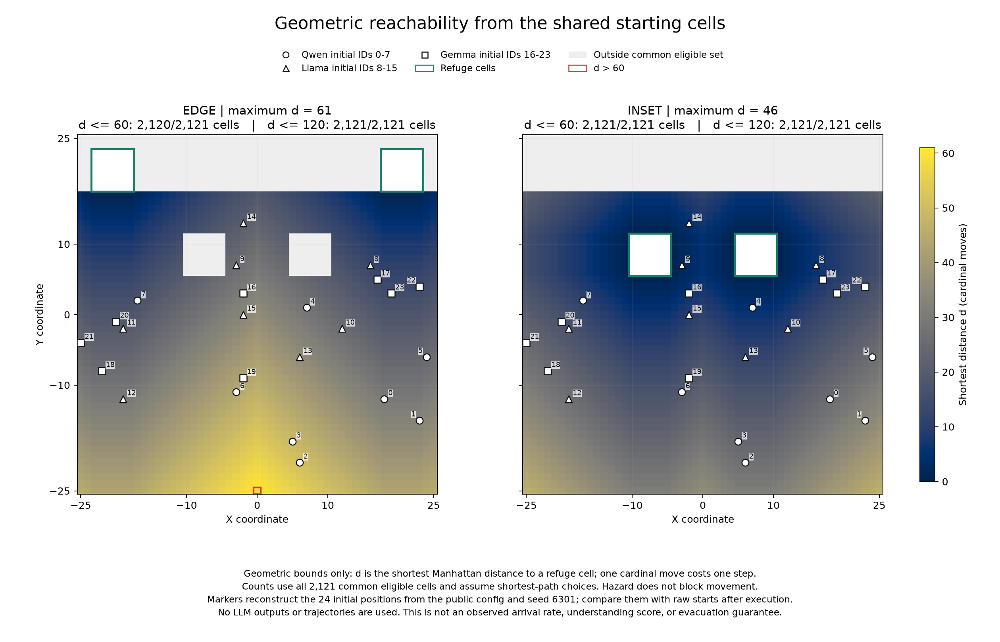
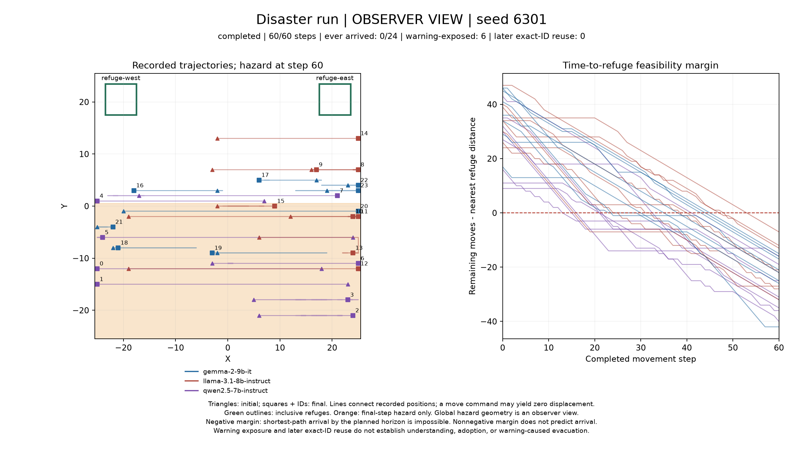
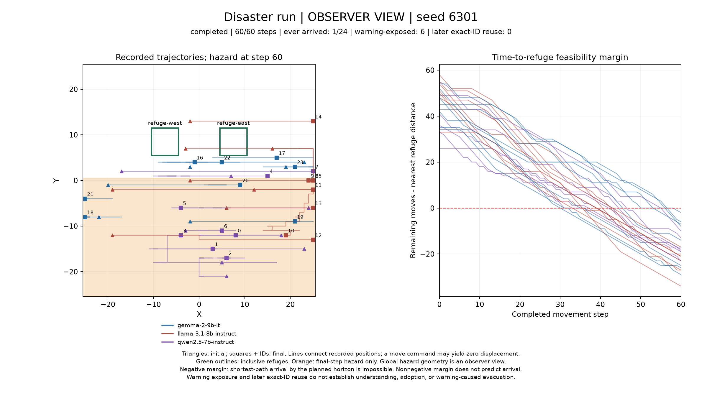

# 混成24体の災害run：避難所配置と60/120 stepの記述的比較

2026-09-10（JST）、Qwen・Llama・Gemma各8体が同じ世界に同居する4 runを実行し、すべて完走した。60-step runの期間内に避難所へ到達した人数は、端配置0/24、中央寄り配置1/24だった。120-step run自身の60→120 stepの変化も、全条件を省略せず以下に示す。1 world seedの記述的観測であり、agentやstepを独立な反復とは数えない。

守りたいのは、異なるAIを経由して情報が伝わり、状況に応じて行動を調整できる機能である。今回の『メタ安全保障』という目的を、情報伝達と行動の連鎖を検証可能にすることとして扱う。測定対象は警報への露出、後続出力、配送、移動選択と記録位置であり、内部認知や現実の安全性改善ではない。

## 固定条件と対照

[事前protocol](EXPERIMENT_PROTOCOL_REFUGE_LAYOUT_STUDY_V1.md)と[4条件のmanifest](../configs/refuge_layout_study_v1/manifest.json)を、推論前のclean source commitに固定した。人数を各モデル8体・計24体とし、混成集団を全条件で維持した。今回の対照は避難所配置と観測時間であり、単一モデル集団との比較は含まない。

モデルはQwen 2.5 7B Instruct、Llama 3.1 8B Instruct、Gemma 2 9B IT。新規seedは6301。初期位置、agent IDとモデル割当、公式警報の初期受信者を4 runで一致させた。公式警報はstep 10に各モデル2体、計6体（IDs 1,5,9,13,17,21）へ1回だけ配信する。危険区域はstep 10/30で拡大し、step 30以降は120まで維持する。step 30に警報を再発行・更新する処理はない。

両配置とも避難所は6×6 cellの矩形2つで、最終危険区域y≤0の外に置く。端配置はx=-23..-18 / 18..23、y=18..23。中央寄り配置はx=-10..-5 / 5..10、y=6..11。配置変更に伴う避難所座標の変化は、各agentのpromptと警報のfactにも反映される。全agentには最初から避難所座標を与えており、未知の場所を『発見する能力』の試験ではない。

通信はfree_text・full・radius 12。temperature 0、max_tokens 1024、context 4096、max_concurrency 24、message最大512文字・memory最大256文字・reasoning空文字を固定した。promptに含むmessageとmemoryはそれぞれ直近最大5件である。bloc/model identity、避難を促す追加の役割・報酬はpromptへ加えていない。repair・fallback・generation retryはいずれも使わなかった。

## 直接観測：全4本の実行

batchは`refuge-layout-study-v1-20260909T162300Z`、推論sourceは`a5f1421818bbbed15fa810b0906fddcc991fa885`（clean）。[実行証拠](../derived/validation-refuge-layout-study-v1-20260909T162300Z/verification.json)の開始は`2026-09-09T17:25:27.545024+00:00`、終了は`2026-09-09T17:56:47.419484+00:00`、wall-timeは1,879.875秒（起動・後片付けを含む）。batch IDのtimestampは識別用で、実際の凍結・開始時刻の主張ではない。

| 実行順・配置 | steps | agents | calls / HTTP attempts | 終端状態・raw metadata |
| --- | ---: | ---: | ---: | --- |
| 端・60 | 60 | 24 | 2,880 / 2,880 | [completed](../runs/output_refuge-layout-study-v1-20260909T162300Z-edge-d60-s6301/run_meta.json) |
| 中央寄り・60 | 60 | 24 | 2,880 / 2,880 | [completed](../runs/output_refuge-layout-study-v1-20260909T162300Z-inset-d60-s6301/run_meta.json) |
| 中央寄り・120 | 120 | 24 | 5,760 / 5,760 | [completed](../runs/output_refuge-layout-study-v1-20260909T162300Z-inset-d120-s6301/run_meta.json) |
| 端・120 | 120 | 24 | 5,760 / 5,760 | [completed](../runs/output_refuge-layout-study-v1-20260909T162300Z-edge-d120-s6301/run_meta.json) |

本体は合計17,280 calls、実行前schema probeは9/9合格、probe込み17,289 HTTP attemptsだった。transport・syntax・schema failuresとretryはすべて0。全4本でsource/config一致、strict validation、coverageと完了gateを確認した。使用GPUは計画・上限とも4台で、最大観測も4台。今回起動したprocess groupの停止、GPUとportの解放を確認した。

生ログはbyte単位でそのまま受け入れ、既存6 runを変更・改名・併合していない。今回のrawも解析・描画によって変更していない。exit codeだけではなく、終端metadata、失敗カウンタ、raw manifestとhashを照合した。

## 機械的導出：開始時の距離

共通の初期eligibleは両配置の避難所を除く2,121 cells。全候補cellの最短距離最大は端61、中央寄り46だが、今回選ばれた24体の初期位置については以下になる。最短距離は障害物のないworldのManhattan距離であり、実際にその経路を選ぶことを仮定しない。

| 配置 | 24体の初期距離・平均 | 最大 | 最短経路なら60 step以内の人数 |
| --- | ---: | ---: | ---: |
| 端 | 27.875 | 51 | 24/24 |
| 中央寄り | 16.125 | 34 | 24/24 |



全24体の初期位置とモデル割当が生ログ間で一致し、このconfigからの再構成とも一致した。両配置とも開始時点では全員に60 step以内で到達できる幾何学的余地がある。これは到達の予測や保証ではない。

## 機械的導出：到達と記録位置

『到達』は初期またはstep末の位置ログが避難所矩形内に入った観測を指す。到達した意図、警報の理解、避難成功とは判定しない。期間内の初回到達と終点での在所を別々に数え、未到達はnull・各checkpointで右打切りとする。危険区域滞在の分母は24×checkpointのagent-stepである。

| 独立run | checkpoint | 期間内到達 | 終点在所 | 終点距離・平均 | 危険域 agent-step / 分母 | move / stay | 変位0のmove |
| --- | ---: | ---: | ---: | ---: | ---: | ---: | ---: |
| 端・60 | 60 | 0/24 | 0/24 | 24.167 | 628/1440 | 1181 / 259 | 265 |
| 中央寄り・60 | 60 | 1/24 | 0/24 | 18.708 | 670/1440 | 1352 / 88 | 335 |
| 中央寄り・120 | 60 | 2/24 | 0/24 | 19.917 | 621/1440 | 1355 / 85 | 220 |
| 中央寄り・120 | 120 | 3/24 | 0/24 | 22.292 | 1514/2880 | 2743 / 137 | 928 |
| 端・120 | 60 | 0/24 | 0/24 | 23.917 | 625/1440 | 1389 / 51 | 309 |
| 端・120 | 120 | 0/24 | 0/24 | 23.917 | 1525/2880 | 2751 / 129 | 1228 |

期間内に到達した全agent-runを示す。60/120 checkpointの重複を避け、各runの最終checkpointから1体1行で列挙した。

| 独立run | agent ID / model | 初回到達step | 最初の警報露出step | 初回到達の原本行 |
| --- | --- | ---: | ---: | --- |
| 中央寄り・60 | 9 / llama-3.1-8b-instruct | 8 | 10 | [positions L202](../runs/output_refuge-layout-study-v1-20260909T162300Z-inset-d60-s6301/positions.jsonl#L202) |
| 中央寄り・120 | 8 / llama-3.1-8b-instruct | 32 | なし | [positions L777](../runs/output_refuge-layout-study-v1-20260909T162300Z-inset-d120-s6301/positions.jsonl#L777) |
| 中央寄り・120 | 9 / llama-3.1-8b-instruct | 8 | 10 | [positions L202](../runs/output_refuge-layout-study-v1-20260909T162300Z-inset-d120-s6301/positions.jsonl#L202) |
| 中央寄り・120 | 14 / llama-3.1-8b-instruct | 98 | なし | [positions L2367](../runs/output_refuge-layout-study-v1-20260909T162300Z-inset-d120-s6301/positions.jsonl#L2367) |

60-step runでの唯一の到達はstep 8であり、公式警報のstep 10より前だった。120-step runのagent 9もstep 8に初回到達し、agent 8・14には警報への露出記録がない。これらの到達を、警報を理解して避難した証拠とは扱わない。

同じrun duration・checkpointでの配置差（中央寄り−端）を示す。距離は各配置の避難所までの距離であり、配置によって初期距離自体も変わる。距離差だけから経路選択の改善とは判断しない。

| 独立runのduration | checkpoint | 到達人数差 | 終点在所差 | 危険域 agent-step差 | 終点距離・平均差 |
| --- | ---: | ---: | ---: | ---: | ---: |
| 60 | 60 | +1 | +0 | +42 | -5.458 |
| 120 | 60 | +2 | +0 | -4 | -4.000 |
| 120 | 120 | +3 | +0 | -11 | -1.625 |

全agentの初期・終点・最小距離、初回到達、打切り、方向選択は[agent_checkpoints.jsonl](../derived/refuge-layout-study-metric-v1.0.0_20260909T180637Z/agent_checkpoints.jsonl)、全stepの位置・変位・最短距離・到達可能性の余裕は[agent_steps.jsonl](../derived/refuge-layout-study-metric-v1.0.0_20260909T180637Z/agent_steps.jsonl)にraw行参照付きで保持した。

残り移動回数は、horizon T・step末sならT−s、最短距離dとの差はT−s−d。負になると、その時点からは最短経路でもTまでに到達できない。過去に到達したことがないという意味ではない。通信時には移動前のs−1位置を使い、当該stepの移動機会も残る。

## 120-step run自身の60→120 step

120-step runは新規IDで最初から実行した。独立60-step runへ追加実行・追記したものではない。延長の主な観測は以下の同一run内の変化である。

| 配置 | 到達人数 60→120 | 在所人数 60→120 | steps 61–120での初回到達 |
| --- | ---: | ---: | ---: |
| 端 | 0→0 | 0→0 | 0 |
| 中央寄り | 2→3 | 0→0 | 1 |

独立した60/120-step runの前半60 stepsについて、parsed Phase 1、Phase 3 action/memory/reasoning、step末位置を照合した。

| 配置 | 前半60 stepsの一致 | 最初の不一致 |
| --- | --- | --- |
| 端 | 不一致 | step 1・phase1・agent 6 |
| 中央寄り | 不一致 | step 1・phase3・agent 2 |

この照合結果を、seedやtemperature 0によるLLMの決定性の保証とは扱わない。別runの終点差を、同じ履歴を単に延長した効果と解釈しない。

## 警報への露出・後続出力・実際の配送

警報metricは変更せずdisaster-metric-v2.0.0を用いた。受信は露出として数え、少なくとも一度の露出より後の数値stepで、自身のPhase 1 messageにexact warning-IDを出力した場合を後続再使用とする。同stepのID出力は後続再使用に含めない。IDの再使用は意味理解や行動への採用の証拠ではなく、非検出も言い換えの否定ではない。

| 独立run | checkpoint | 公式 / 中継の露出events | 露出した人数 | 後続再使用人数 / outputs | 異モデルへの配送edges・全message / exact ID |
| --- | ---: | ---: | ---: | ---: | ---: |
| 端・60 | 60 | 6 / 0 | 6/24 | 0 / 0 | 4426 / 0 |
| 中央寄り・60 | 60 | 6 / 0 | 6/24 | 0 / 0 | 3980 / 0 |
| 中央寄り・120 | 60 | 6 / 0 | 6/24 | 0 / 0 | 4128 / 0 |
| 中央寄り・120 | 120 | 6 / 0 | 6/24 | 0 / 0 | 9680 / 0 |
| 端・120 | 60 | 6 / 0 | 6/24 | 0 / 0 | 3354 / 0 |
| 端・120 | 120 | 6 / 0 | 6/24 | 0 / 0 | 6482 / 0 |

配送edgeはmessages.jsonlに記録されたsender→receiverの1件である。同じmessageの複数受信者や別stepの配送は別edgeと数える。露出人数は公式・中継をまたぐ受信者の和集合で数える。今回の中継露出は0だった。受信・生成・配送・後続再使用は別の出来事として扱う。

全条件の集計は[summary.json](../derived/refuge-layout-study-metric-v1.0.0_20260909T180637Z/summary.json)、warning v2の全agent/output記録は[warning_agents.jsonl](../derived/refuge-layout-study-metric-v1.0.0_20260909T180637Z/warning_agents.jsonl)と[warning_outputs.jsonl](../derived/refuge-layout-study-metric-v1.0.0_20260909T180637Z/warning_outputs.jsonl)に保存した。

## 事前規則による混成通信の一例

事前規則に該当する60-step run内の異モデルexact-ID配送はなく、例示はnullとして保存した。別種のmessageへ選択規則を変更して置き換えていない。

[example.json](../derived/refuge-layout-study-metric-v1.0.0_20260909T180637Z/example.json)には該当なしを表すnullとその理由を保存した。model-generated reasoningは出力説明欄であり、内部思考の記録とは扱わない。

## 避難所・危険区域・警報の可視化

各runについて全24体を対象に、HTML replayとPNGを生成した。観測者が知る避難所を固定した緑枠、危険区域をstepに応じた領域として描く。agentにはモデル別の色とIDを付けるが、これは観測者向けの表示でありpromptには含まれない。通信時の矢印はmessages.jsonlの実受信者と移動前位置を使い、step末表示では移動後位置に配送矢印を重ねない。公式警報、露出、出力、後続exact-ID再使用を区別し、step 30を再発令として描かない。

| 独立run | replay | 全軌跡・到達余地のPNG | 来歴 |
| --- | --- | --- | --- |
| 端・60 | [HTMLを開く](https://suii00.github.io/mixed-cognition-sim-research/derived/disaster-run-replay-v1.0.0_20260909T180820Z_edge-d60-s6301/replay.html) | [PNG](../derived/disaster-run-replay-v1.0.0_20260909T180820Z_edge-d60-s6301/summary.png) | [manifest](../derived/disaster-run-replay-v1.0.0_20260909T180820Z_edge-d60-s6301/input_manifest.json) |
| 中央寄り・60 | [HTMLを開く](https://suii00.github.io/mixed-cognition-sim-research/derived/disaster-run-replay-v1.0.0_20260909T180820Z_inset-d60-s6301/replay.html) | [PNG](../derived/disaster-run-replay-v1.0.0_20260909T180820Z_inset-d60-s6301/summary.png) | [manifest](../derived/disaster-run-replay-v1.0.0_20260909T180820Z_inset-d60-s6301/input_manifest.json) |
| 中央寄り・120 | [HTMLを開く](https://suii00.github.io/mixed-cognition-sim-research/derived/disaster-run-replay-v1.0.0_20260909T180820Z_inset-d120-s6301/replay.html) | [PNG](../derived/disaster-run-replay-v1.0.0_20260909T180820Z_inset-d120-s6301/summary.png) | [manifest](../derived/disaster-run-replay-v1.0.0_20260909T180820Z_inset-d120-s6301/input_manifest.json) |
| 端・120 | [HTMLを開く](https://suii00.github.io/mixed-cognition-sim-research/derived/disaster-run-replay-v1.0.0_20260909T180820Z_edge-d120-s6301/replay.html) | [PNG](../derived/disaster-run-replay-v1.0.0_20260909T180820Z_edge-d120-s6301/summary.png) | [manifest](../derived/disaster-run-replay-v1.0.0_20260909T180820Z_edge-d120-s6301/input_manifest.json) |

HTMLリンクはGitHub Pagesで直接開く。[公開成果物一覧](https://suii00.github.io/mixed-cognition-sim-research/)からも全4本を選択できる。各manifestと同じ保存ディレクトリの`replay.html`をダウンロードしてローカルで開く方法も利用できる。配信ファイルは保存済み成果物とバイト単位で同一であり、生ログ・解析結果・manifestは変更していない。

配置比較を優先する60-step runの図を示す。三角は初期位置、四角とIDは終点、線は記録位置を結ぶ。重なる記号は同じcellへの在所を含み、move出力と実際の変位は区別する。





4 PNGは目視QA、4 HTMLの自作JavaScriptはNode v22.19.0の静的構文検査を実施した。PNGの近接する終点IDには一部重なりがあるが、位置をずらしてはいない。HTMLには個別agent表を用意している。HTMLの実ブラウザ操作・表示確認はブラウザURLポリシーに拒否され、未実施である。迂回による確認は行っていない。

## 来歴と検証限界

| 項目 | 記録 |
| --- | --- |
| 推論source | `a5f1421818bbbed15fa810b0906fddcc991fa885`、clean |
| 解析source | `d6fa9ad6c2b4ecb539eb488de356c49bbb75ef88`、clean |
| protocol | `refuge-layout-study-v1.0.0` |
| prompt / response / log | `bounded-prompts-v3.0.0` / `phase-response-v3.0.0` / `2.0.0` |
| transport | `single-generation-strict-json-no-redirect-v3.0.0` |
| 配置・時間metric / spec SHA | `refuge-layout-study-metric-v1.0.0` / `98fe0001bdbd64395f196f727c45ac2ee946b4e3bd43cb53ceb8165aea71e700` |
| 警報metric / spec SHA | `disaster-metric-v2.0.0` / `cd0ca4fec67d945a2b878fe5c0c7e49391e9bacf10a3f7aa0a142f7962cbf711` |

[解析metadata](../derived/refuge-layout-study-metric-v1.0.0_20260909T180637Z/analysis_meta.json)と[生成物manifest](../derived/refuge-layout-study-metric-v1.0.0_20260909T180637Z/derived_manifest.json)に来歴を記録した。[最終検証](../derived/refuge-layout-study-verification-v1.0.0_20260909T181058Z/verification.json)ではraw・分析・図・replayのhash、JSONL引用行、4本の初期位置、geometryとreplayデータの再導出、推論sourceに含まれる仕様・実装bytesとの一致を確認した。全入力treeは検査前後で不変だった。

推論前の全体回帰検証は390 tests・121 subtests合格、1 skipだった。最終修正後の集計14 tests、geometry5 tests・4 subtests、公開独立検算6 tests・4 subtestsも合格した。skipはWindowsで実symlinkを作る権限に関するもので、権限不要のreparse拒否検査は合格している。公開用の最終検証ツールには2種類の参照契約と5件の拒否ケースの自己テストを加えた。

実行verificationに記録された推論backendはvLLM 0.27.1、torch 2.13.0+cu132である。依存packageと固定モデルartifact factsは実行証拠およびraw metadataを参照できる。ローカル解析・描画・報告生成のPythonは3.12.10、描画のMatplotlibは3.11.1。

[独立検算](../derived/refuge-layout-study-independent-v1.0.0_20260909T180815Z/observations.json)では、別実装のstdlibによる計算本体でrawから再集計し、4 run・6 run-checkpoints・144 agent-checkpoints、配置比較、前半履歴と120内延長を照合した。7,062項目の比較で不一致は0だった。[検算コード](../tools/audit_refuge_layout_observations.py)も公開した。warningのsurface-fact分類とv2のterminal evacuation-suffix、runtimeの実行証明・暗号学的真正性はこの独立再計算の対象外である。

strict validationが合格しても、以下の未検証事項は残る。

- complete dependency environment: one or more package versions were unavailable
- cryptographic authenticity: raw_manifest hashes are not externally signed
- dependency versions unavailable: matplotlib
- global event identity for primary logs: schema 2.0 event IDs cover attempt, termination, and disaster events, but not every primary Phase/message row
- operational endpoint address identity: runtime bindings are deliberately excluded from public artifacts

モデルrevision、tokenizer/chat template、推論backendも条件の一部である。固定snapshotと公開設定の来歴を記録して整合性を確認したが、今回すべてのweight bytesの独立checksumを再計算したという証拠ではない。run_metaのchat_template_hashはdescriptor文字列のhashであり、descriptor内のtemplate SHAとは区別する。

モデル別の初期位置・警報recipientの役割を入れ替えるcounterbalanceや複数seedの反復はしていない。混成集団と単一モデル集団の差、モデルの優劣、警報が移動を引き起こした因果効果はこの設計では判断しない。先行4-agent runとは人数・初期eligible・並列負荷も異なり、同じ実験の反復として併合しない。`research_eligible=false`、`formal_eligible=false`を維持する。

以下は、解析source `d6fa9ad6c2b4ecb539eb488de356c49bbb75ef88` の作業ツリーにおけるrepository rootで、保存済みrawから再解析する例。最新mainではvalidator等が更新されており、旧実験の凍結sourceとのバイト一致検査に通らない場合がある。過去commit用の作業ツリーの作り方は[公開と再解析の案内](PAGES_PUBLICATION.md#過去runの再解析)を参照。未使用のUTC timestampを指定し、既存run/derivedは上書きしない。この版のanalyzerでは相対`--manifest`がsource照合時に拒否されるため、既定manifestを用いる（明示する場合は絶対パスが必要）。初回の相対パスによる解析停止では派生出力は作られず、設定や計測コードを変えずに既定パスで再解析した。

```bash
python tools/build_refuge_layout_study.py --check
python tools/verify_repository.py
python tools/analyze_refuge_layout_study.py \
  --output-dir derived/refuge-layout-study-metric-v1.0.0_<UTC_TIMESTAMP> \
  --metric-spec-sha256 98fe0001bdbd64395f196f727c45ac2ee946b4e3bd43cb53ceb8165aea71e700
```
